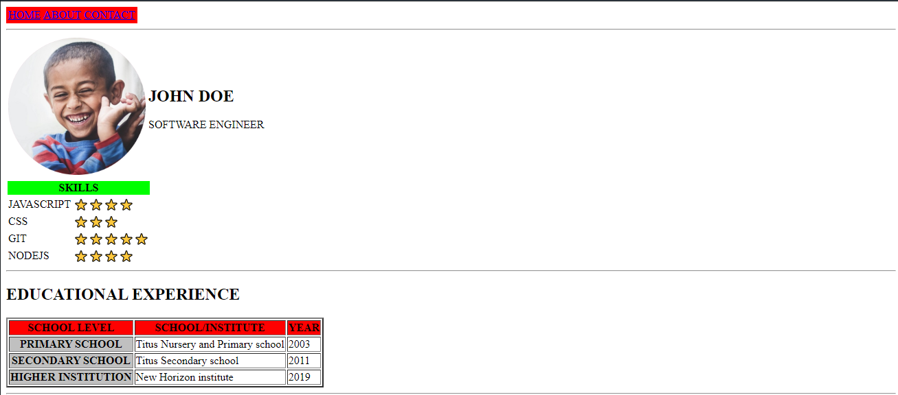
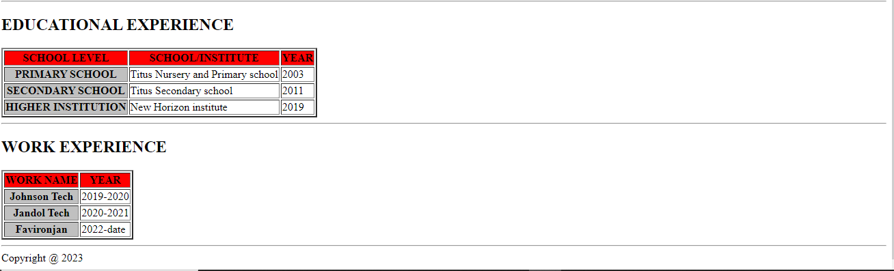

# Assignment(Final HTML Project)

You are to submit  your CV to the new company you applied for, and the company owner wants you to submit it in HTML project, attempt to create a full webpage that links to different pages;

1. about.html

2. contact.html

3. projects.html

On the Homepage(index.html) you should create a design using html table for your layouts(<tr> for rows and <td> for columns).

You are expected to add your picture at the top after the navigation bar, you can use;

https://profilepicturemaker.com to make a circular image for your beautiful picture

## Extra resources

1. [HTML Tables (w3schools.com)](https://www.w3schools.com/html/html_tables.asp)

2. [Basic HTML Page layout using Table tag - Example & Program (tutorialsclass.com)](https://tutorialsclass.com/code/basic-html-layout-using-table/)

<u>FINISHED PICTURES</u>

