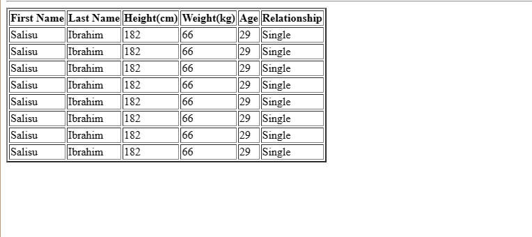

# Assignment(Tables)

Assuming your coach in your training ground has been having problem to sought out names of everyone in the team and biodata. He has been thinking for months on how to solve this problem and then comes you that purposed to him a smart to solve it by create a simple webpage to solve this... The webpage should have the following

1. header text using h1 and also a horizontal line to differentiate the header

2. A form for entering data to the table(This won't be used but just to get your hands dirty)

3. A table that looks like the image below:
   
   
   
   

4. Create a footer tag that shows copyright @ 2023 together with the name of your soccer team
